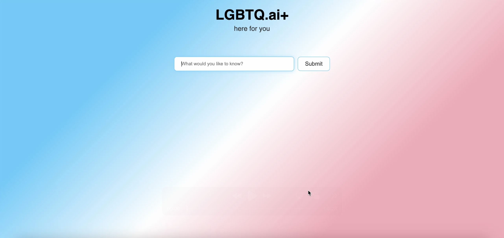

# LGBTQ.ai+

**LGBTQ.ai+** is an machine learning and AI-assisted content curation and classification platform built to support and uplift queer communities, especially trans folks, in an era of information overload and queer oppression. It aims to curate and generate content tailored to the real needs of LGBTQIA+ individuals, with a focus on trust, transparency, and joy.

This project uses a custom-built machine learning model in the backend that detects bias in online content and classifies the content accordingly (pro- or anti- trans). When a user queries the frontend app, a semantic similariy RAG search is conducted between the user's query and the data that the backend model has been trained on. This way, the data that the model is using to formulate its response is guaranteed to be helpful, relevant, trusted, and supportive towards the communities that it is serving.

---

## Project Goals

- **Protect** trans users by flagging harmful content and prioritizing affirming, trusted sources.
- **Curate** content using semantic search and article embeddings, ensuring topical accuracy.
- **Classify** articles using a triplet-loss deep learning model that distinguishes between pro- and anti-trans content.
- **Expand** from trans-specific support to broader LGBTQ+ and BIPOC communities globally.

---

---

## Repo Structure

| Folder            | Description                                                                 |
|------------------|-----------------------------------------------------------------------------|
| `airflow-docker/` | Backend. DAGs and Docker setup for orchestrating backend workflows (retraining, deployment). |
| `demo_2/`         | Frontend. Main application logic: LLM calls, classification pipeline, embedding generation. |
| `mk1-site/`       | First prototype of the frontend site (static site and layout exploration).       |
| `mk2-site/`       | Updated, refined frontend site for interacting with the platform.                |

---

## Tech Stack

- **Vertex AI** — Model deployment and GPU inference
- **Hugging Face Transformers** — LLM-based classification
- **TripletNet** — Embedding model trained with human-labeled article triplets (for automated trusted-sites sourcing and classifications)
- **MongoDB** — Secure data storage for articles and metadata
- **Airflow + Docker** — Pipeline orchestration for scheduled retraining and model deployment
- **FAISS** — Fast similarity search for article retrieval

---

## Environment

Environment variables are loaded from `.env` files located in key folders (e.g., `airflow-docker/`, `demo_2/lgbtq_rag_system/model/`). These are **excluded from the public repo** via `.gitignore`.

The Dockerfiles in `airflow-docker/` and `demo_2/lgbtq_rag_system/` contain all necessary environment setups/installations.

---

## Current State

This is an early-stage project! We currently do not have the site up and running due to costs involving VertexAI calls, but we aim to continue building. Over time, we hope to expand to support other communities, and continue to collect relevant, up-to-date data as the cultural, social, and political landscape for trans folk constantly evolve.

---

## License

This project is under development and not yet licensed for redistribution. If you’d like to use or build upon this work, please reach out directly.
